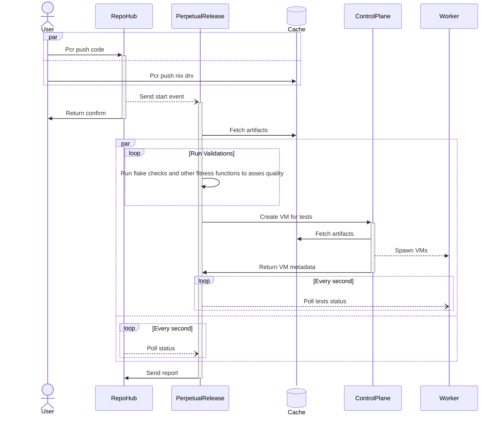

# Procurator — Nix-Native VM Orchestrator

A GitOps-driven VM orchestrator. Think Kubernetes, but replacing containers and YAML with **Nix closures** and **cloud-hypervisor VMs**. Git commits produce immutable VM images via Nix; the system continuously reconciles running VMs to match.

**Core invariant:** The cluster converges to a set of Nix derivations produced from a Git commit, evaluated outside the cluster, scheduled deterministically, and executed immutably. No `apply` command — Git is the only write interface.

## Architecture

```
                        ┌──────────────────────────────────────┐
                        │           User Interface             │
                        │    CLI (pcr) / Repohub (web)         │
                        │         │            │               │
                        │    autonix       autonix             │
                        │  (scan repo,   (scan repo,           │
                        │   gen flake)    gen flake)            │
                        └────┬─────────────────┬───────────────┘
                             │                 │
                        pcr push          post-receive hook
                        (build +           (trigger CI)
                         push to               │
                         cache)                 │
                             │          ┌───────▼──────────┐
                             │          │    CI Service     │
                             │          │                   │
                             │          │  nix eval/build   │
                             ▼          │  pull from cache  │
                     ┌──────────────┐   │  push on miss     │
                     │ Binary Cache │◄──┤  notify ctrl plane│
                     │  (nix-serve) │   └───────┬───────────┘
                     └──────┬───────┘           │
                            │           ┌───────▼───────────┐
                            │           │   Control Plane    │
                            │           │                    │
                            │           │  desired state     │
                            │           │  scheduler         │
                            │           │  worker registry   │
                            │           └───────┬────────────┘
                            │                   │ RPC (Cap'n Proto)
                            │          ┌────────┴────────┐
                            │          ▼                 ▼
                            │   ┌────────────┐    ┌────────────┐
                            └──►│  Worker 1  │    │  Worker 2  │
                                │            │    │            │
                                │ VmManager  │    │ VmManager  │
                                │   ├ CH VM  │    │   ├ CH VM  │
                                │   ├ CH VM  │    │   ├ CH VM  │
                                │   └ CH VM  │    │   └ CH VM  │
                                └────────────┘    └────────────┘
```

## GitOps Flow

```
1. pcr push ──► cache (user builds + pushes closures upfront)
2. git push ──► repohub ──► post-receive hook ──► CI Service
3. CI ──► nix eval/build (pulls from cache when possible, pushes on miss)
4. CI ──► notify control plane with deployment artifact
5. Control plane ──► schedule VMs to workers
6. Workers ──► pull from cache ──► boot cloud-hypervisor VMs
```

## Components

### Rust Crates (workspace)

| Crate | Role | README |
|-------|------|--------|
| [`worker`](worker/README.md) | Manages cloud-hypervisor VM processes on a host | VM lifecycle, actor model, 22 unit tests |
| [`control_plane`](control_plane/README.md) | Stores desired state, schedules VMs to workers | Master RPC interface, coordinator |
| [`cli`](cli/README.md) | User-facing CLI tool (`pcr`) + RPC test binaries | init, stack, repo, inspect |
| [`ci_service`](ci_service/README.md) | Evaluates Nix, builds closures, publishes to cache | Triggered by git push |
| [`repohub`](repohub/README.md) | Web UI for project & repository management | Axum + Askama + SQLite |
| [`cache`](cache/README.md) | Nix binary cache server (nix-serve compatible) | Serves NARs to workers |
| [`commands`](commands/README.md) | Cap'n Proto RPC schema definitions | Shared wire format |
| [`repo_outils`](repo_outils/README.md) | Git & Nix utility library | Shared plumbing |
| [`autonix`](autonix/README.md) | Scans repos, auto-generates Nix flakes | Onboarding automation |

### Nix Infrastructure

| Directory | Role | README |
|-----------|------|--------|
| [`nix/`](nix/README.md) | Flake, lib pipeline, NixOS modules, tests | 4-layer VM building pipeline |
| [`nix/GITOPS_WORKFLOW.md`](nix/GITOPS_WORKFLOW.md) | GitOps workflow reference | Step-by-step: git push → running VM |
| [`nix/examples/`](nix/examples/) | Reference cluster configuration | Sample `flake.nix` |

## Tech Stack

- **Language:** Rust (edition 2024), Tokio async runtime
- **RPC:** Cap'n Proto (zero-copy, capability-based)
- **Hypervisor:** Cloud Hypervisor (one process per VM, REST API over unix socket)
- **Package/Image:** Nix (flakes, closures, binary cache, content-addressed store)
- **VM images:** NixOS minimal (kernel + SSH, ~500-700MB)
- **Persistence:** SQLite (repohub, ci_service), in-memory (control plane)

## Development

```nushell
cargo build                     # Build all workspace members
cargo build -p worker           # Build worker only
cargo test -p worker            # Run worker tests (22 tests)
cargo test --workspace          # Run all tests
cargo run -p worker             # Run worker (127.0.0.1:8080)
cargo run -p cli --bin pcr-worker-test -- --help
```

## Testing the Worker

For quick manual testing, use the flake apps in two terminals:

```nushell
# terminal 1: start worker
nix run ./nix#worker

# terminal 2: generate artifacts
nix build ./nix/examples/python-workload#artifacts

# terminal 2: call worker RPCs
nix run .#worker-test -- read
nix run .#worker-test -- list
nix run .#worker-test -- create
nix run .#worker-test -- delete --id <vm-id>
```

`worker-test` defaults to `--addr 0.0.0.0:8080` and accepts extra inline flags for `create` (kernel, initramfs, disk, cmdline, cpu, memory, console, serial).


# Subdomain proxy — running it

## Why
The worker runs a TLS-terminated HTTPS reverse proxy so browser/SDK clients can reach OpenCode servers inside VMs. Requests go to `https://<vm-id>.worker.local:8443/<path>` and the proxy routes them to the right VM by extracting the VM id from the `Host` header.

## Commands

```bash
# Terminal 1: Boot the worker (generates wildcard dev TLS cert on first run)
nix run .#worker

# Terminal 2: Mint a JWT for a VM and curl through the proxy
nix run .#worker-curl -- <vm-id> <path> [curl-args...]

# Examples
nix run .#worker-curl -- 019e16f4-abc /doc
nix run .#worker-curl -- 019e16f4-abc /session -X POST -H 'content-type: application/json' -d '{}'
nix run .#worker-curl -- 019e16f4-abc /event -N   # SSE streaming

# Just print a JWT (pipe it into your own curl)
nix run .#worker-token -- <vm-id>

# Create the bootstrap URL for a VM
nix run .#worker-bootstrap-url -- 019e4777-a67a-7480-b6e9-a03b8a6ce158
```

## Expected output with no VMs
The proxy logs `auth_result = "route_not_found"` with `vm_id = "<vm-id>"`. That's correct — it proves the subdomain routing pipeline works; there's just no VM registered yet.


## Project Status

| Component | Status |
|-----------|--------|
| Worker (VM lifecycle) | **Active focus** — functional with full test suite |
| Nix lib pipeline | **Working** — 4-layer architecture with fast + integration tests |
| Commands (RPC schemas) | **Working** — stable protocol definitions |
| Autonix (flake gen) | **Working** — repo scanning and flake generation |
| Repo Outils | **Working** — git/nix utilities |
| Cache (binary cache) | **Working** — nix-serve compatible |
| CLI | Scaffolded — command structure defined, `init` implemented |
| Control Plane | Scaffolded — RPC server + message passing, scheduler is stub |
| CI Service | Scaffolded — job queue + HTTP API, build logic in progress |
| Repohub | Scaffolded — CRUD functional, integrations planned |



