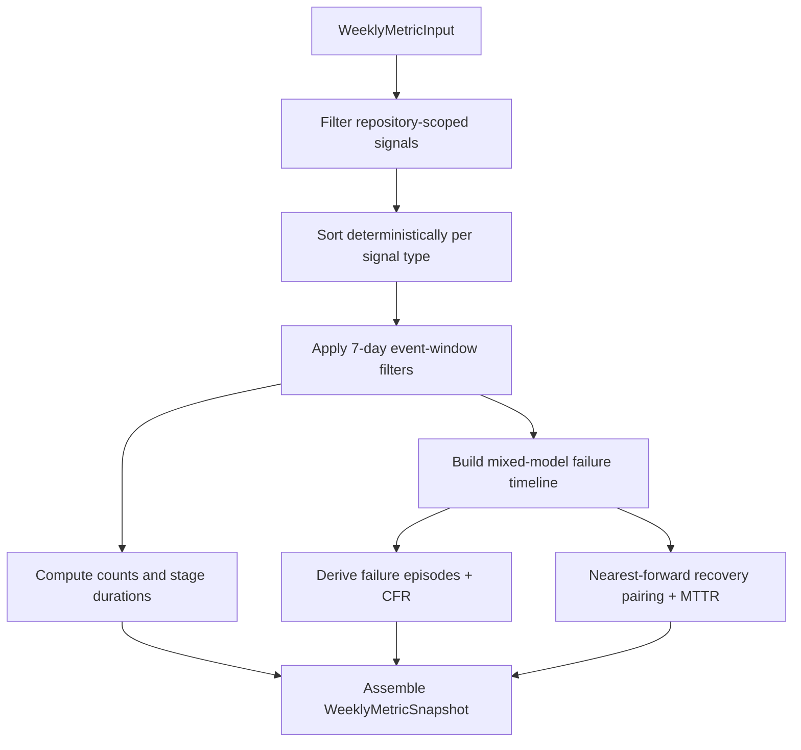

# Repohub Weekly Metrics Engine (T06)

Canonical behavior for `repohub/src/domain/metrics.rs` (`WeeklyMetricEngine`).

## Scope
- Computes weekly DORA + productivity metrics from normalized signals.
- Produces a deterministic `WeeklyMetricSnapshot` payload for persistence and API read paths.
- Defines CFR/MTTR mixed-model episode semantics from production deployments + incident issues.

## Input/Output Contract
- Input: `WeeklyMetricInput`
  - `repository_id`, `week_start_utc`, `metric_version`
  - `incident_label_patterns`
  - normalized signal collections (`pull_requests`, `reviews`, `commits`, `deployments`, `issues`)
- Output: `WeeklyMetricSnapshot`
  - `window_days = 7` (`WEEKLY_WINDOW_DAYS`)
  - `week_start_utc` serialized RFC3339
  - `metrics: WeeklyMetrics`

## Window Semantics
- Fixed 7-day UTC window per snapshot.
- Half-open interval: `timestamp >= week_start_utc && timestamp < week_start_utc + 7d`.
- Inclusion uses the metric-specific event timestamp (not entity creation fallback).

## Determinism Contracts
- PR order: `(opened_at, id)`
- Review order per PR: `(submitted_timestamp, id)`
- Commit order: `(committed_timestamp, sha)`
- Deployment order: `(deployed_at, id)`
- Failure/recovery event order for CFR/MTTR: `(occurred_at, source_key)` where `source_key` is `deployment:{id}` or `issue:{id}`.
- Median contract: integer median (`i64`), even cardinality uses integer midpoint truncation via integer division.
- Payload determinism: same input -> byte-equivalent JSON from `serialize_payload`.

## Metric Event Anchors
- PR-opened metrics (`pr_opened_count`, `pr_size_median`, `review_depth_median`, coding stage): PR `opened_at` in window.
- Merge metrics (`merge_frequency_count`, `time_to_merge`, review stage): PR `merged_at` in window.
- Review activity (`total_reviews_count`, pickup/review_time): review `submitted_at` in window.
- Commit activity (`commits_count`, `code_changes_count`): commit `committed_at` in window.
- Deployment activity (`deployment_frequency_count`, deployment stage, lead time): deployment `deployed_at` in window.

## CFR/MTTR Mixed-Model Semantics
- Candidate failure/recovery points come from:
  - production deployments (`success` => recovery, non-success => failure)
  - incident issues projected through `to_failure_signal(incident_label_patterns)`
- Failure episode rule (CFR numerator): first failure after clean/recovered state.
- CFR denominator: count of production deployments in window.
- CFR output:
  - `None` when denominator is zero
  - otherwise `failures/deployments` clamped to `[0.0, 1.0]`
- MTTR rule: for each in-window failure episode, pair with nearest forward recovery not already consumed by earlier failure pairing.
- MTTR output: median of paired recovery durations in seconds; `None` when no valid pairs.

## Metric Formulas (v1 Canonical)

All metrics derive from repository-scoped signals filtered to a 7-day UTC window `[week_start, week_start + 7d)`.
Deterministic ordering contracts apply before any computation (see §Determinism Contracts).

### Count Metrics

| Metric | Formula | Nullable |
|--------|---------|----------|
| `pr_opened_count` | Count of PRs with `opened_at` in window | No |
| `merge_frequency_count` | Count of PRs with `merged_at` in window | No |
| `deployment_frequency_count` | Count of production deployments (`is_production = true`) with `deployed_at` in window | No |
| `commits_count` | Count of commits with `committed_at` in window | No |
| `code_changes_count` | Sum of `commit.additions + commit.deletions` for commits in window | No |
| `total_reviews_count` | Count of reviews with `submitted_at` in window for repository-scoped PRs | No |
| `merged_without_review_count` | Count of merged PRs in window where `reviews_by_pr[pr.id]` is empty or absent | No |
| `handoffs_count` | Sum across all PRs of adjacent review pairs `(r[n], r[n+1])` where `r[n].user_id != r[n+1].user_id`, both reviews in window | No |

### Median Metrics (all `i64` seconds)

Integer median: values sorted ascending, `(values[mid] + values[mid-1]) / 2` for even cardinality (integer truncation). Returns `None` when no valid pairs exist.

| Metric | Duration Formula | Window Anchor |
|--------|-----------------|---------------|
| `pr_size_median` | `pr.additions + pr.deletions` (raw integer, not seconds) | PR `opened_at` |
| `review_depth_median` | Count of reviews per PR (raw integer, not seconds) | PR `opened_at` |
| `review_time_median_seconds` | `first_review.submitted_at - pr.opened_at` | `first_review.submitted_at` |
| `pr_pickup_time_median_seconds` | Same as `review_time_median_seconds` (identical helper) | `first_review.submitted_at` |
| `time_to_merge_median_seconds` | `pr.merged_at - pr.opened_at` | PR `merged_at` |
| `deployment_time_median_seconds` | `first_prod_deployment.deployed_at - pr.merged_at` | `deployed_at` |
| `lead_time_for_changes_median_seconds` | `first_prod_deployment.deployed_at - first_commit.authored_at` (via `coding_started_at()`) | `deployed_at` |
| `cycle_coding_median_seconds` | `pr.opened_at - first_commit.authored_at` | PR `opened_at` |
| `cycle_pickup_median_seconds` | Same as `pr_pickup_time_median_seconds` | `first_review.submitted_at` |
| `cycle_review_median_seconds` | `pr.merged_at - first_review.submitted_at` | PR `merged_at` |
| `cycle_deploy_median_seconds` | Same as `deployment_time_median_seconds` | `deployed_at` |

**First-entity resolution rules** (used by `first_review`, `first_commit`, `first_deployment`):

- **First review per PR**: Earliest `submitted_timestamp` from `reviews_by_pr[pr.id]` (reviews already sorted).
- **First commit per PR**: Earliest `coding_started_at` among commits matching `pr.head_sha` or `pr.merge_commit_sha` (whichever is earlier).
- **First production deployment per PR**: Earliest `deployed_at >= merged_at` among deployments matching `pr.merge_commit_sha` or `pr.head_sha`.

### DORA Rates

| Metric | Formula | Nullable When |
|--------|---------|-------------|
| `change_failure_rate` | `failure_episodes_in_window / production_deployments_in_window`, clamped to `[0.0, 1.0]` | Zero production deployments in window |
| `mttr_seconds` | Median of `recovery.occurred_at - failure.occurred_at` for nearest-forward paired episodes | No valid recovery pairs |

**Mixed-model CFR/MTTR episode construction:**
1. Collect all `FailurePoint` events from production deployments (success→recovery, non-success→failure) and incident issues (open with matching label→failure, closed with matching label→recovery at `closed_at`).
2. Sort by `(occurred_at, source_key)` where `source_key = "deployment:{id}"` or `"issue:{id}"`.
3. Walk timeline: first failure after clean/recovered state starts a **failure episode**.
4. CFR denominator = count of production deployments in window.
5. MTTR: for each in-window failure episode index, search forward from `max(episode_index + 1, last_consumed_recovery_index + 1)` for the next recovery point. Consume each recovery at most once (nearest-forward, no backfill).

## Edge-Case Contracts Covered by Tests
- Boundary inclusion/exclusion at exact window edges (`[start, end)`).
- Nullability when required events are absent (e.g., no deployments => `change_failure_rate=None`, `mttr_seconds=None`).
- Median behavior for empty/even sets.
- Deterministic tie-break for same-timestamp CFR/MTTR events.
- Idempotent, byte-equivalent payload serialization for identical inputs.

## Flow

See also: [normalized-signals.md](normalized-signals.md), [persistence.md](persistence.md), [../glossary.md](../glossary.md), [../overview.md](../overview.md)
