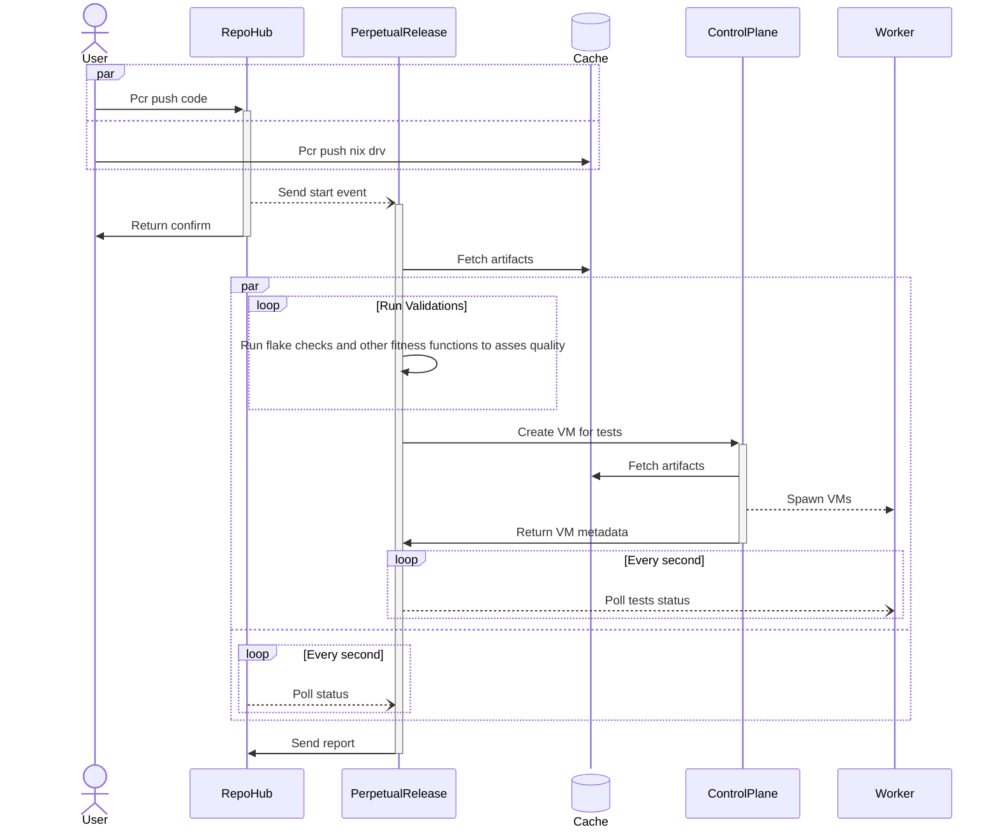

Flow when a push occurs

```mermaid
sequenceDiagram
    actor User
    participant RepoHub
    participant PerpetualRelease

    participant Cache@{ "type" : "database" }

    participant ControlPlane
    participant Worker

    par
        User->>+RepoHub: Pcr push code
    and
        User->>Cache: Pcr push nix drv
    end
    RepoHub --)+ PerpetualRelease: Send start event
    RepoHub->>-User: Return confirm

    PerpetualRelease->>Cache: Fetch artifacts

    par
        loop Run Validations
            PerpetualRelease->>PerpetualRelease: Run flake checks and other fitness functions to asses quality
        end
        PerpetualRelease->>+ControlPlane: Create VM for tests
        ControlPlane->>Cache: Fetch artifacts
        ControlPlane-->>Worker: Spawn VMs
        ControlPlane->>-PerpetualRelease: Return VM metadata
        loop Every second
            PerpetualRelease--)Worker: Poll tests status
        end
    and
        loop Every second
            RepoHub--)PerpetualRelease: Poll status
        end
    end

    PerpetualRelease->>-RepoHub: Send report
```

Maybe we don't need to run all the 'heavy' tests running in VMs?
